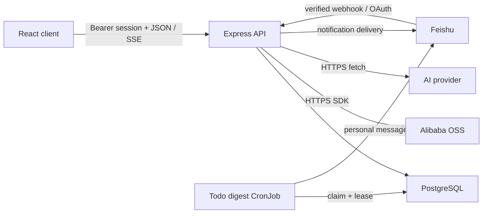

# Architecture

## System Shape

Veges is a single deployable Node.js application with a React client, an Express API,
PostgreSQL persistence, and optional Alibaba OSS, Feishu, and OpenAI-compatible AI
integrations. `docs/personal-project-dashboard-prd.md` records the original product
direction; current code is authoritative where that early document still describes a
single-user, non-collaborative first phase.

The production image builds `src/` into `dist/`, copies `server/`, and starts
`server/index.ts` on Node 24. Express serves both `/api/*` and the client SPA.

## Module Boundaries

- `src/App.tsx`, `src/components/`: UI state and user workflows. They must not hold
  database, OSS credential, or authorization decisions.
- `src/ai-attachments.ts`: browser-side text attachment format checks, display sizing,
  and bounded serialization into a new AI turn. Attachments are
  not uploaded to object storage or assigned project identity here.
- `src/ai-conversation-state.ts`, `src/components/ai-conversation-history-panel.tsx`:
  client-only history navigation, immutable-context selection, pagination merge, and
  responsive history UI. PostgreSQL remains the conversation source of truth.
- `src/todo-proposal-defaults.ts`: pending proposal review defaults for browser display.
  A missing due date becomes the current `Asia/Shanghai` calendar date only while the
  batch remains editable.
- `src/api.ts`, `src/types.ts`: browser API adapter, SSE recovery, and public client-side
  contracts.
- `server/index.ts`: HTTP boundary, authentication, project authorization, request
  validation, Feishu/AI orchestration, and static-file serving.
- `server/ai-provider.ts`, `server/ai-period-summary.ts`,
  `server/ai-todo-proposals.ts`: shared AI configuration, provider network boundary,
  period facts, and strict Markdown proposal parsing.
- `server/ai-todo-confirmation.ts`: the typed PostgreSQL insert contract used when
  confirmed proposal candidates become todos. Reused user-ID placeholders are cast at
  every SQL occurrence so PostgreSQL cannot infer conflicting parameter types.
- `server/ai-conversations.ts`, `server/ai-conversation-store.ts`: conversation domain
  validation, encrypted persistence, authorization, canonical model history, turn leases,
  idempotency, retry/cancel transitions, and artifact links.
- `server/ai-turn-stream.ts`, `shared/ai-conversation-wire.ts`,
  `shared/server-sent-events.ts`: bounded response backpressure, canonical turn DTO guards,
  and the server/browser AI stream protocol.
- `shared/ai-input-intent.ts`: one natural-language intent classifier shared by the browser
  and server without importing browser code into the production server image.
- `server/todo-digest.ts`, `server/todo-digest-worker.ts`: local-time scheduling,
  deterministic digest formatting, run leases, retries, and Feishu delivery.
- `server/project-package-timeline.ts`: package timeline domain logic, transactional
  multi-table writes, encrypted timeline fields, and Markdown export.
- `server/package-market.ts`: OSS configuration, package rules, object-key allowlisting,
  object access, and signed download URLs.
- `server/schema.ts`: idempotent PostgreSQL DDL and integrity indexes.
- `server/crypto.ts`: AES-256-GCM envelopes and blind indexes.
- `server/db.ts`: the shared PostgreSQL pool. Domain modules must use one checked-out
  `PoolClient` for every atomic multi-statement operation.

## Request And Authorization Path

Password or Feishu sign-in creates a random session token stored in `sessions` for 30
days. Protected endpoints accept `Authorization: Bearer <token>`. Project-scoped routes
must resolve `getProjectAccess(projectId, userId)` before reading or mutating nested IDs;
owner-only actions add an explicit role check.

`AI_API_BASE`, `AI_API_KEY`, and `AI_MODEL` form one deployment-level provider
configuration. Users never submit or read AI credentials. When that shared provider is
configured, password registration requires an active project invite; Feishu OAuth can
still create or link an internal user. AI calls pass both per-user and application-replica
sliding-window limits.

Veges AI conversations are private to the authenticated user and persist in PostgreSQL.
Each conversation has an immutable `general`, `project`, or `conversation-analysis`
context. General chat receives no implicit workspace facts; project context is selected
explicitly by ID and is reauthorized on every list, read, send, retry, and completion path.
Lost project access hides history without rewriting it, while project deletion cascades it.

The browser sends only one user turn with client-generated conversation/turn UUIDs. The
server serializes the first-turn claim with a transaction-scoped advisory lock, stores the
encrypted structured intent and user turn before the provider call, builds model history
from the latest three completed canonical turns, and never trusts client-submitted assistant
history. The same advisory lock makes a concurrent replay wait for the canonical turn before
the rate-limit callback is consumed, while a rate-limited new UUID fails before conversation,
turn, or attachment writes. One partial unique index permits only one processing turn per
conversation. External provider calls run without an open database transaction;
completion writes require the same active lease token and unexpired lease. Cancellation clears
the lease; if cancellation wins before creation, a bounded `ai_turn_cancellations` claim is
serialized by both the conversation lock and a per-user cancellation lock. The claim keeps one
immutable conversation owner for its turn UUID and makes every delayed replay exit before any
provider call. Retry assigns a new lease, and the authenticated reconcile route turns an expired
processing lease into a retryable failure. A duplicate turn UUID with the same payload returns
the canonical turn without consuming another provider request.

Turn creation and retry use a POST response stream with ordered `started`, `delta`, `progress`,
`heartbeat`, `completed`, `failed`, and `cancelled` events. Ordinary chat and conversation
analysis emit text deltas. Project-summary and todo-extraction turns expose only the fixed
`preparing`, `generating`, `validating`, and `saving` phases, so partial provider JSON never
reaches the browser. A heartbeat is sent every 10 seconds; stalled response backpressure is
abandoned after 5 seconds. Closing the browser connection stops transport only and does not
cancel provider work or canonical completion. Explicit stop uses the cancel route. The server
rechecks the active lease and project access before each project-bound delta and before the final
write. Provider text is provisional until `completeAiTurn` atomically saves the final turn and
artifact; the browser reconciles PostgreSQL after an unconfirmed stream end.

Project-bound turn creation/completion, proposal confirmation, and project deletion also
share a project advisory lock. Multi-project confirmation acquires those locks in numeric
order. Deletion then locks conversations and pending batches before the project row, so an
in-flight completion cannot insert an orphan proposal batch and confirmation cannot deadlock
against project removal.

Text attachments are read in the browser and submitted with their source turn. Original
names and content are encrypted in `ai_turn_attachments`; history responses expose only
safe name, media type, size, and ordering metadata, and their SQL path does not select
attachment content. The selected project ID remains a
separate field and is never parsed from attachment text. Pending browser file reads are
invalidated when project or conversation context changes.

External entry points have separate trust boundaries:

- Feishu event callbacks require `FEISHU_VERIFICATION_TOKEN`, including challenge
  requests.
- Conversation-analysis webhooks require configured HTTP Basic credentials.
- AI provider URLs must use HTTPS, contain no credentials, resolve only to public
  addresses, and are fetched without following redirects. If system DNS returns only
  `198.18.0.0/15` proxy Fake-IP addresses for a hostname, the provider boundary verifies
  its A and AAAA records through a fixed public DNS-over-HTTPS endpoint before allowing
  the request. Every validated result is pinned to the outbound connection while the
  original hostname remains the TLS SNI and HTTP Host; literal and ordinary private
  addresses remain forbidden.
- OSS endpoints must be HTTPS origins. Package object keys must match configured package
  rules or base templates before storage and again before URL signing.
- Todo image uploads require a user session; reads require an HMAC-signed object key.

## Data Model

The schema is normalized around these groups:

- Identity: `users`, `sessions`.
- Projects and collaboration: `projects`, `project_memberships`,
  `project_invite_links`, `project_integrations`, `collaborators`.
- Project knowledge: `journal_entries`, `todos`, `project_modules`,
  `todo_activity_events`, `todo_notes`, `todo_note_mentions`, `risks`, `draft_items`,
  `summaries`, `ai_todo_proposal_batches`, `ai_todo_proposals`.
- Personal AI history: `ai_conversations`, `ai_turns`, `ai_turn_attachments`, permanent deleted
  UUID records in `ai_conversation_tombstones`, and bounded pre-creation cancellation claims in
  `ai_turn_cancellations`. Summary and todo-proposal outcomes link back through `source_turn_id`.
- Notifications: `notification_states`, `notification_deliveries`,
  `notification_subscriptions`, `notification_digest_runs`.
- Package delivery: `project_package_events`, `project_package_groups`,
  `project_package_items`, `project_package_operations`,
  `project_package_operation_todos`.

Foreign keys define deletion behavior. Deleting an AI conversation first records its UUID in a
tombstone, then cascades its turns and attachments; saved summaries and processed proposal
batches retain nullable source links, while the delete transaction explicitly removes only
linked pending proposal batches. Start and delete share the conversation advisory lock, so a
late turn request cannot race past the tombstone and recreate deleted history.
Already-created todos remain independent. Unique indexes protect active invite
links, membership identity, generated todo notes, one processing AI turn per conversation,
one artifact link per source turn, and one auto-generated operation per package group.

## Encryption And Integrity

Sensitive text uses the `veges:enc:` AES-256-GCM envelope. Reads accept legacy plaintext
so migration can be incremental; all new writes to protected fields must call
`encryptText`, and all consumers must call `decryptText`. Blind indexes support equality
lookups where ciphertext is nondeterministic.

Protected data includes project names/descriptions/tags, journals, todo titles/details,
activity snapshots and notes, risks, drafts, summaries, Markdown proposal sources and
candidate text, AI conversation titles, turn content, attachment names/content, digest
content, encrypted AI intent payloads, collaborator/member identity fields, package event
titles, package operation titles/content, and operation-to-todo notes.
Identity keys, status fields, timestamps, object keys, and relationship IDs remain
queryable metadata.

Atomicity rules:

- A package-item batch validates every item before opening a transaction, then commits
  groups, items, generated operations, and event timestamps together.
- Creating or updating a package operation commits its record, todo links, mirrored todo
  notes, and event timestamp together.
- Todo creation and state changes commit the todo and append-only activity events
  together. Completion or reopen first locks the todo row so concurrent requests observe
  one authoritative previous state and preserve the actual completion actor and time.
- Confirming a Markdown proposal batch locks the batch, its current project access, and the
  referenced project/module/assignee rows. A project conversation cannot redirect candidates
  to another project. Selected todos and activity events commit together; incomplete or
  unauthorized candidates never partially save.
- Starting an AI turn takes a per-conversation advisory lock, creates or locks the
  conversation, validates the immutable context, allocates a monotonic turn number, stores
  encrypted intent/content/attachments, and installs the lease in one transaction. Provider
  work runs outside that transaction. Completion locks the conversation and turn, rechecks
  project access and lease identity, and returns the canonical turn snapshot from the same
  transaction that commits assistant content plus any summary/proposal artifact.
- Disconnecting Feishu disables the user's daily digest subscription in the same
  transaction that clears the bound identity.
- Concurrency safety must be enforced by database constraints plus conflict-safe SQL,
  not by a standalone select-before-insert check.

## Startup And Deployment Boundary

Server startup validates encryption keys and executes `schemaSql`; starting the API is a
database mutation, not a read-only smoke test. There is no automatic down migration.
The Sealos template provisions PostgreSQL, injects runtime configuration, probes
`/api/health`, deploys one application replica, and runs the todo-digest worker every
five minutes. Digest runs are unique per subscription/date, claimed with row locking and
a lease, retried at most three times, and terminally failed when the last lease expires.
Build receipts and deployment state under `.sealos/` are historical evidence; all three
template image references and both live workload images are deployment sources of truth.
