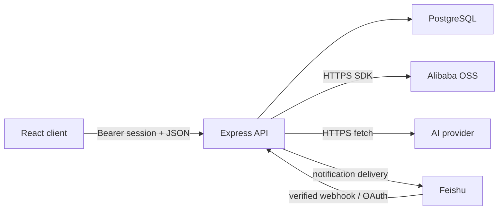

# Architecture

## System Shape

Veges is a single deployable Node.js application with a React client, an Express API,
PostgreSQL persistence, and optional Alibaba OSS, Feishu, and OpenAI-compatible AI
integrations. `docs/personal-project-dashboard-prd.md` records the original product
direction; current code is authoritative where that early document still describes a
single-user, non-collaborative first phase.

The production image builds `src/` into `dist/`, copies `server/`, and starts
`server/index.ts` on Node 24. Express serves both `/api/*` and the client SPA.

## Module Boundaries

- `src/App.tsx`, `src/components/`: UI state and user workflows. They must not hold
  database, OSS credential, or authorization decisions.
- `src/api.ts`, `src/types.ts`: browser API adapter and public client-side contracts.
- `server/index.ts`: HTTP boundary, authentication, project authorization, request
  validation, Feishu/AI orchestration, and static-file serving.
- `server/project-package-timeline.ts`: package timeline domain logic, transactional
  multi-table writes, encrypted timeline fields, and Markdown export.
- `server/package-market.ts`: OSS configuration, package rules, object-key allowlisting,
  object access, and signed download URLs.
- `server/schema.ts`: idempotent PostgreSQL DDL and integrity indexes.
- `server/crypto.ts`: AES-256-GCM envelopes and blind indexes.
- `server/db.ts`: the shared PostgreSQL pool. Domain modules must use one checked-out
  `PoolClient` for every atomic multi-statement operation.

## Request And Authorization Path

Password or Feishu sign-in creates a random session token stored in `sessions` for 30
days. Protected endpoints accept `Authorization: Bearer <token>`. Project-scoped routes
must resolve `getProjectAccess(projectId, userId)` before reading or mutating nested IDs;
owner-only actions add an explicit role check.

External entry points have separate trust boundaries:

- Feishu event callbacks require `FEISHU_VERIFICATION_TOKEN`, including challenge
  requests.
- Conversation-analysis webhooks require configured HTTP Basic credentials.
- AI provider URLs must use HTTPS, contain no credentials, resolve only to public
  addresses, and are fetched without following redirects.
- OSS endpoints must be HTTPS origins. Package object keys must match configured package
  rules or base templates before storage and again before URL signing.
- Todo image uploads require a user session; reads require an HMAC-signed object key.

## Data Model

The schema is normalized around these groups:

- Identity: `users`, `sessions`, `ai_settings`.
- Projects and collaboration: `projects`, `project_memberships`,
  `project_invite_links`, `project_integrations`, `collaborators`.
- Project knowledge: `journal_entries`, `todos`, `project_modules`, `todo_notes`,
  `todo_note_mentions`, `risks`, `draft_items`, `summaries`.
- Notifications: `notification_states`, `notification_deliveries`.
- Package delivery: `project_package_events`, `project_package_groups`,
  `project_package_items`, `project_package_operations`,
  `project_package_operation_todos`.

Foreign keys define deletion behavior. Unique indexes protect active invite links,
membership identity, generated todo notes, and one auto-generated operation per package
group.

## Encryption And Integrity

Sensitive text uses the `veges:enc:` AES-256-GCM envelope. Reads accept legacy plaintext
so migration can be incremental; all new writes to protected fields must call
`encryptText`, and all consumers must call `decryptText`. Blind indexes support equality
lookups where ciphertext is nondeterministic.

Protected data includes project names/descriptions/tags, journals, todo titles/details
and notes, risks, drafts, summaries, AI settings, collaborator/member identity fields,
package event titles, package operation titles/content, and operation-to-todo notes.
Identity keys, status fields, timestamps, object keys, and relationship IDs remain
queryable metadata.

Atomicity rules:

- A package-item batch validates every item before opening a transaction, then commits
  groups, items, generated operations, and event timestamps together.
- Creating or updating a package operation commits its record, todo links, mirrored todo
  notes, and event timestamp together.
- Concurrency safety must be enforced by database constraints plus conflict-safe SQL,
  not by a standalone select-before-insert check.

## Startup And Deployment Boundary

Server startup validates encryption keys and executes `schemaSql`; starting the API is a
database mutation, not a read-only smoke test. There is no automatic down migration.
The Sealos template provisions PostgreSQL, injects runtime configuration, probes
`/api/health`, and deploys one application replica. Build receipts and deployment state
under `.sealos/` are historical evidence; the template image and live workload are the
deployment sources of truth.
